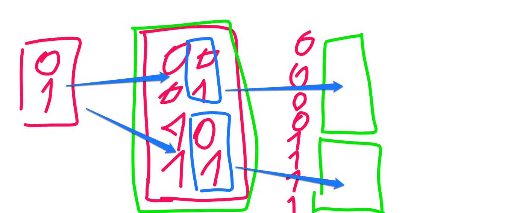
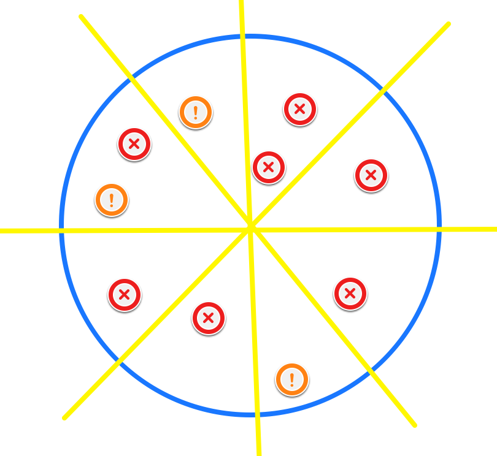

## Darstellung von Informationen im Rechner

###Grundlagen

*Wahrheitswerte:* "Licht ein" ODER "Licht aus"; 1 ODER 0; Strom fließt ODER Strom fließt nicht

Diese Informationen können vom Rechner gespeichert und mit anderen Wahrheitswerten kombiniert werden:

00, 01, 10, 11

<i class="fa-warning"></i>
**Wichtig: Zustände müssen unabhängig sein**

###Zwei Zustände kombiniern:



###Wo haben wir bitmuster?



8 Stück können gegessen werden

``2^8 = 256``

Diese Bitmustern z.B. 001101001 ordnen wir Zeichen, Zahlen, Buchstaben zu:

**Zahlen:**
````
0000 0000 => 0
0000 0001 => 1
0000 0010 => 2
0000 0011 => 3
0000 0100 => 4
[...]
````

---

2